# Git task-start performance and SSH reuse

Kanban keeps task worktrees fresh without moving a developer's local branch:

1. A workspace connection queues a background `git fetch --all --prune` to warm SSH authentication and remote-tracking refs.
2. A new task resolves its base commit from the fetched remote-tracking branch and creates a detached worktree at that commit.
3. Kanban never automatically runs `git pull` on the developer's checkout. Pull remains an explicit, fast-forward-only action.

## SSH authentication

Each Kanban runtime creates an OpenSSH control-master directory. Git subprocesses and task agents inherit a command equivalent to:

```text
ssh -o ControlMaster=auto -o ControlPersist=8h -o ControlPath=<runtime socket>
```

The first Git operation for an effective SSH account can require Touch ID. Later Git operations, agents, and task worktrees reuse its control master for up to eight idle hours. A graceful Kanban shutdown closes these runtime-scoped masters.

Kanban delegates account selection to SSH. For multiple GitHub accounts, use explicit SSH host aliases and point each repository remote at the appropriate alias:

```sshconfig
Host github-personal
  HostName github.com
  User git
  IdentityFile ~/.ssh/id_ed25519_personal
  IdentitiesOnly yes

Host github-work
  HostName github.com
  User git
  IdentityFile ~/.ssh/id_ed25519_work
  IdentitiesOnly yes
```

```text
git@github-personal:Cascoopman/example.git
git@github-work:company/example.git
```

This keeps accounts isolated while letting all Kanban agents using the same alias share one authenticated master. Do not add private keys or account secrets to Kanban configuration.

## Fetch scheduling

The fetch scheduler has one SSH-safe execution lane, but two priorities:

- **Interactive:** task creation. These requests run before queued warmups.
- **Background:** workspace-open warming.

Concurrent requests for the same repository share one fetch. A successful fetch is reused for 30 seconds, so task creation immediately after workspace warmup does not run a second network request.

```mermaid
gantt
  title Queued fetches: before and after interactive priority
  dateFormat  X
  axisFormat %L ms
  section Before
  warmup A       :0, 1000
  warmup B       :1000, 1000
  warmup C       :2000, 1000
  new task       :3000, 1000
  section After
  warmup A       :0, 1000
  new task       :1000, 1000
  warmup B       :2000, 1000
  warmup C       :3000, 1000
```



| Scenario | Before | After | Difference |
| --- | ---: | ---: | ---: |
| A task arrives behind two queued 1-second warmups | 3 s queue wait | 1 s queue wait | 67% less waiting |
| Task follows a successful fetch less than 30 seconds old | another fetch | no fetch | removes one network round-trip |
| No queued or recent fetch | unchanged | unchanged | task still fetches fresh refs |

The scheduler test in `test/runtime/task-base-ref.test.ts` covers queue priority, same-repository promotion, in-flight coalescing, and expiry of the freshness window.
